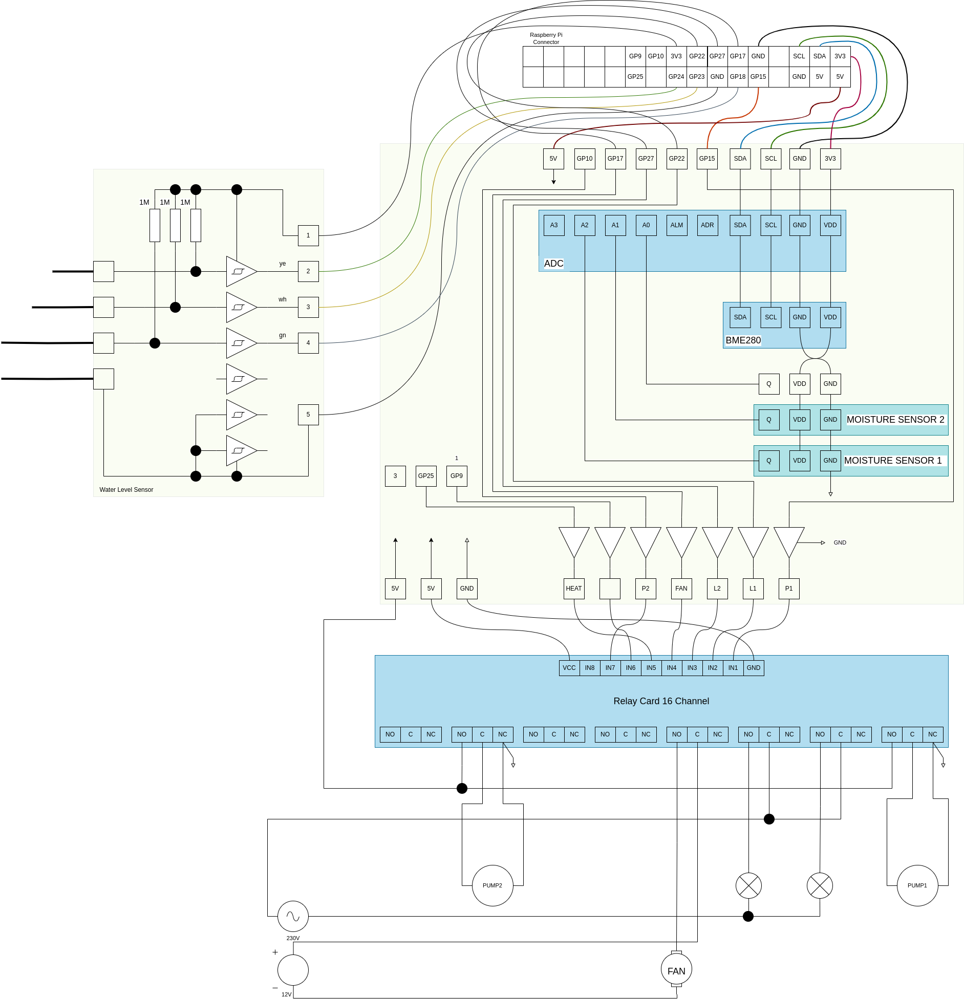

# Grow Control

UNDER DEVELOPMENT 


## Tasks of software

* soil moisture: regulate different pots from a single water reservoir
* temperature: measure it
* humidity: measure it
* fan: regulate it
* light: control it
* provide an html interface to set all parameters
  and monitor current measurements (inclusive a graph of some parameters)
* send notification (e.g. mail) if any issues


## Required Python packages

```
pip3 install smbus2
pip3 install pimoroni-bme280==0.0.2
```

## Hardware



* ADC: Analog-Digital Converter ADS1115
* BME280
* Moisture Sensor: Capacitive Soil Moisture Sensor
* Water Level Sensor build with CD40106
* Relay Card 16 Channel
* Driver for Relay Card is an ULN2003