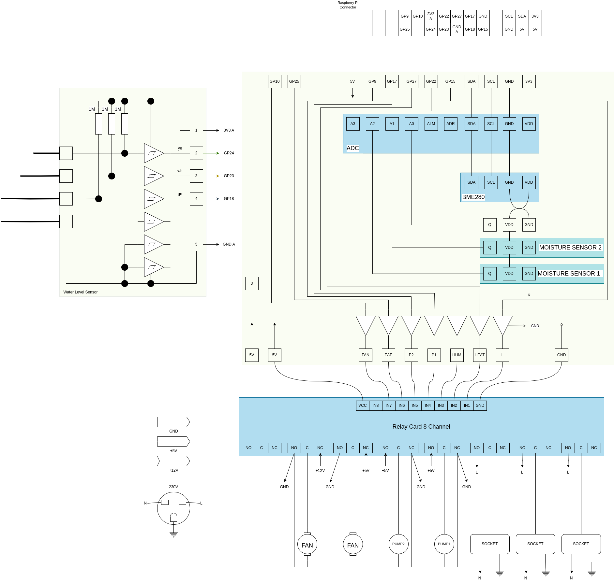

# Grow Control

_Grow Control_ is a piece of hardware and software to control and regulate 
conditions for an indoor garden.

The software is written in Python and runs on a Raspberry Pi. It performs the following tasks:

* soil moisture: regulate different pots from a single water reservoir
* temperature: measure it
* humidity: measure it
* fan: regulate it dependent on temperature and humidity
* light: control it
* provide an html interface to set all parameters
  and monitor current measurements (inclusive a graph of some parameters)
* send notification (e.g. mail) if any issues


## Get started

Run the following commands to get started:

```
sudo apt update
sudo apt full-upgrade
sudo apt-get install python3-venv build-essential python-dev python-smbus git
# enable I2C
sudo raspi-config
git clone https://github.com/achkoe/growcontrol.git
python3 -m venv ~/venv/vgc
. ~/venv/vgc/bin/activate
pip install -r requirements.txt
cd growcontrol/
```


## Screeshots of Web GUI


## Software module communication


## Hardware

### Schema



### BOM

* ADC: Analog-Digital Converter ADS1115
* BME280
* Moisture Sensor: Capacitive Soil Moisture Sensor
* Water Level Sensor build with CD40106
* Relay Card 16 Channel
* Driver for Relay Card is an ULN2003

### Water level sensor


